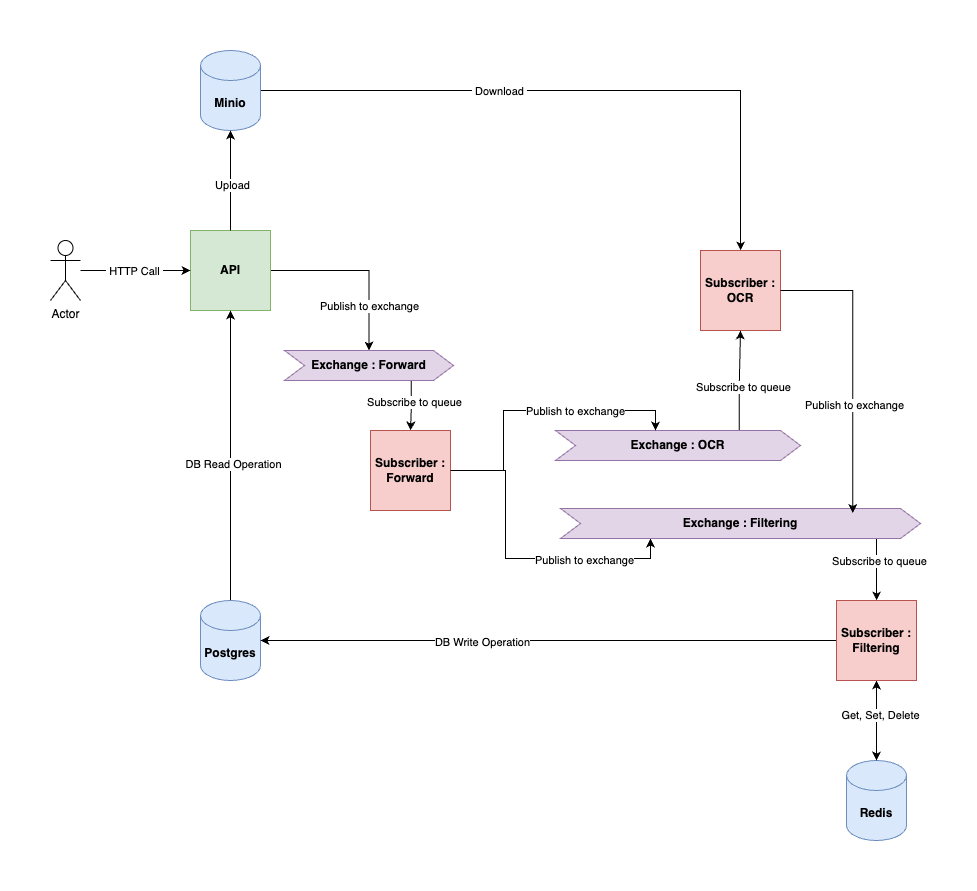

# PIIrate Hunter

## Project Architecture Overview




This project is a microservices-based application that leverages several external services to handle image processing and filtering of Personally Identifiable Information (PII) terms. The architecture is designed for scalability, fault tolerance, and efficient processing using asynchronous message passing. Each component is capable of horizontal scaling, allowing individual services to be scaled independently based on load and processing needs. The key external services are:

- **RabbitMQ**: Used for message queuing between different services.
- **Redis**: Acts as a caching mechanism for aggregating results from different message queues.
- **PostgreSQL**: A relational database used to store the final processed results.
- **Minio**: A self-hosted S3-compatible object storage solution for storing images.


### Project Components

#### FastAPI Application
The FastAPI service is responsible for two core actions:
- **Submit Image and PII Terms**:
  - Accepts an image file and a list of PII terms.
  - The image is uploaded to Minio, generating a URL.
  - A message containing the image URL and PII terms is published to a RabbitMQ forward exchange. A unique correlation ID is generated, which is returned to the user. This ID is passed through the entire pipeline, linking all operations.

- **Search by Correlation ID**:
  - After processing is completed, the user can search using the correlation ID to retrieve the matched PII terms and filtered results.

#### Forward Service (RabbitMQ Subscriber)
This subscriber listens for messages on the forward exchange and performs the following tasks:
- Receives an image URL and the corresponding PII terms.
- Publishes two separate messages:
  - To the **OCR Exchange**, providing the image URL for text recognition.
  - To the **Filtering Exchange**, providing the PII terms for matching.

#### OCR Service (RabbitMQ Subscriber)
This service is responsible for performing Optical Character Recognition (OCR):
- It listens to the OCR exchange, receives the image URL, and processes the image to extract text bounding boxes.
- The results (bounding boxes) are published to the **Filtering Exchange**.

#### PII Filtering Service (Aggregator and RabbitMQ Subscriber)
The filtering service is responsible for matching PII terms against the OCR results:
- It listens to two queues:
  - The first queue receives OCR results (bounding boxes).
  - The second queue receives PII terms.
- Using Redis, it temporarily caches results from these queues. Once both results are available, it performs the filtering process.
- After filtering, the results are stored in PostgreSQL, linked to the correlation ID for later retrieval.

### Disclaimer

This solution is implemented as a monorepo for simplicity. In a production setup, each of these components would potentially be deployed as separate microservices, each with its own Dockerfile, requirements, and deployment configurations. The decision to separate these services would depend on the specific business requirements, allowing for independent scaling, deployment, and maintenance of each service.

## Code Structure
```
├── Dockerfile
├── README.md
├── alembic.ini
├── app
│   ├── __init__.py
│   ├── api
│   │   ├── __init__.py
│   │   ├── main.py
│   │   └── routers
│   │       ├── __init__.py
│   │       └── pii.py
│   ├── config.py
│   ├── db
│   │   ├── __init__.py
│   │   ├── controllers
│   │   │   ├── __init__.py
│   │   │   └── matches.py
│   │   └── factories.py
│   ├── factories.py
│   ├── models
│   │   ├── database.py
│   │   └── validation.py
│   ├── utils.py
│   └── workers
│       ├── filter.py
│       ├── forward.py
│       └── ocr.py
├── docker-compose.yaml
├── images
│   ├── api-get.png
│   ├── api-post.png
│   ├── diagram.png
│   └── image.png
├── migrations
│   ├── README
│   ├── env.py
│   ├── script.py.mako
│   └── versions
│       └── fbe2a5753a96_initial_migration.py
├── requirements.txt
├── scripts
│   ├── example.py
│   └── initialise.py
└── tests
    ├── __init__.py
    ├── images
    │   ├── blank_image.png
    │   └── test_image.png
    └── utils_test.py
```

## Environment Settings

| Variable                     | Default Value                          | Description                                 | Type            |
|-------------------------------|----------------------------------------|---------------------------------------------|-----------------|
| MINIO_ENDPOINT                | localhost:9000                         | MinIO server endpoint                       | `str`           |
| MINIO_ROOT_USER               |                                        | MinIO root user                             | `str`           |
| MINIO_ROOT_PASSWORD           |                                        | MinIO root password                         | `str`           |
| MINIO_SECURE                  | True                                   | Use HTTPS for MinIO communication           | `bool`          |
| MINIO_BUCKET                  |                                        | MinIO bucket                                | `str`           |
| MINIO_PATH                    |                                        | MinIO path                                  | `str`           |
| REDIS_HOST                    | localhost                              | Redis host                                  | `str`           |
| REDIS_PORT                    | 6379                                   | Redis port                                  | `int`           |
| REDIS_HOSTS                   | local:localhost:6379                   | Redis multiple hosts                        | `str`           |
| RABBITMQ_HOST                 | localhost                              | RabbitMQ host                               | `str`           |
| RABBITMQ_DEFAULT_USER         |                                        | RabbitMQ host                               | `str`           |
| RABBITMQ_DEFAULT_PASS         |                                        | RabbitMQ username                           | `str`           |
| POSTGRES_HOST                 |                                        | Postgres password                           | `str`           |
| POSTGRES_PORT                 |                                        | Postgres port                               | `int`           |
| POSTGRES_USERNAME             |                                        | Postgres username                           | `str`           |
| POSTGRES_PASSWORD             |                                        | Postgres password                           | `str`           |
| POSTGRES_DATABASE             |                                        | Postgres database name                      | `str`           |
| API_TITLE                     | PII Detection API                      | API title                                   | `str`           |
| API_DESCRIPTION               | An API that identifies PII data in images using OCR | API description                | `str`           |
| API_VERSION                   | 0.0.1                                  | API version                                 | `str`           |

## Setup

### Prerequisites

Ensure you have `docker` and `docker compose` installed on your machine.

### Environment Setup

Copy the `.env.sample` file to `.env` and configure the environment variables as needed:

```bash
cp .env.sample .env
```

### Build Docker Image

Build the Docker image with the following command:

```bash
docker build -t piirate-hunter:latest .
```

## Running the Application

### Start Services

Start all the services using Docker Compose:

```bash
docker compose up -d
```
During the startup, an **one-off job** (setup) will:
- Create a Minio bucket
- Initialize a PostgreSQL table using Alembic migrations

### Run End-To-End Example

Use the following docker command to run a prefined example that
test the project end-to-end:

```bash
docker run --rm --network my_network -v "$(pwd):/app" piirate-hunter:latest python -m scripts.example
```

This example will:
1.	Send a POST request to the API with an image and PII terms, receiving a correlation_id.
2.	Poll an endpoint with the correlation_id to get results when the task is completed.
3.	**Bonus feature**: Use the results to blur the PII terms in the original image and generate a new image.


## Running Tests

To run the tests using pytest, execute:

```bash
docker run --rm piirate-hunter:latest sh -c 'pip install pytest && pytest tests/'
```

## Demo

That project is currently deployed on my personal GCP account. Below are the relevant links:
- Swagger API : https://piirate-hunter.cocoware.io/docs
- Redis : https://redis.cocoware.io/
- RabbitMQ : https://rabbitmq.cocoware.io/
- Minio : https://minio.cocoware.io/

### Usage

First, submit a POST request to the API [here](https://piirate-hunter.cocoware.io/docs#/PII/submit_pii_post), including the image (Step 1) and the PII terms (Step 2) in the request body. The API will respond with a correlation ID (Step 3), which you’ll use to track the process.


Next, send a GET request to the API [here](https://piirate-hunter.cocoware.io/docs#/PII/read_result_pii__correlation_id__get), using the correlation ID (Step 4) to retrieve the results. The response will contain the bounding boxes of the matched PII terms (Step 5).


## Proposal: Cloud-Native Architecture on GCP

This architecture replaces the existing long-running services with GCP’s managed services for a fully serverless and pay-as-you-go approach.

1. **API Deployment (FastAPI)**:
   - Replace with: [Cloud Run] – A serverless platform that automatically scales your app based on demand, only charging you when it’s used.

2. **Message Broker (RabbitMQ)**:
   - Replace with: [Pub/Sub] – A fully managed messaging service that scales automatically and doesn’t need any setup. It’s pay-as-you-go, perfect for handling variable workloads.

3. **Object Storage (Minio)**:
   - Replace with: [Google Cloud Storage] – A reliable, scalable file storage service. No need to manage storage infrastructure, and it integrates well with other GCP services.

4. **In-Memory Cache (Redis)**:
   - Replace with: [MemoryStore (Redis)] – A managed Redis service that scales automatically, so no need to manage servers. Perfect for fast, temporary data storage.

5. **Database (PostgreSQL)**:
   - Replace with: [Cloud SQL] – A fully managed PostgreSQL database that handles backups, scaling, and failovers automatically, with easy setup.

### Key Change:

Instead of using long-running services (workers), your workers will become serverless functions running on Cloud Run. They scale automatically and can go to zero when not in use, saving costs. Pub/Sub handles messaging between services with no manual configuration required.

### Benefits:

- **Serverless and pay-as-you-go** – Only pay for what you use.
- **Automatic scaling** – Everything grows and shrinks automatically as needed.
- **No infrastructure management** – GCP takes care of the heavy lifting for you.
